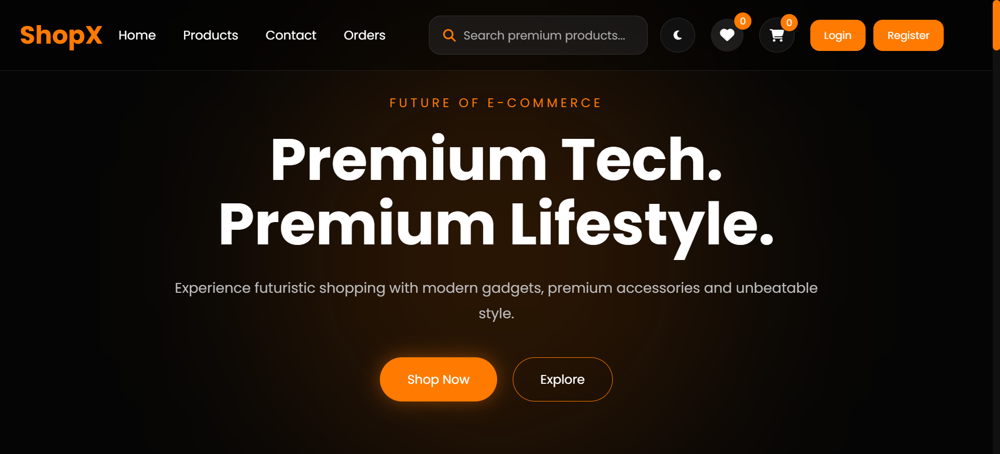
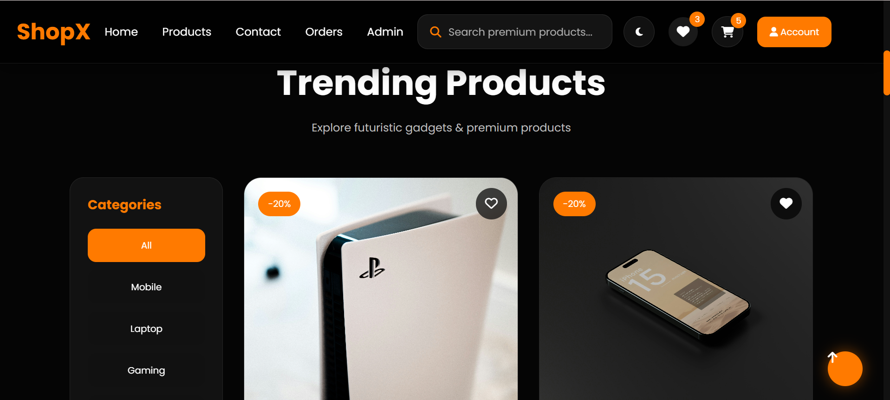
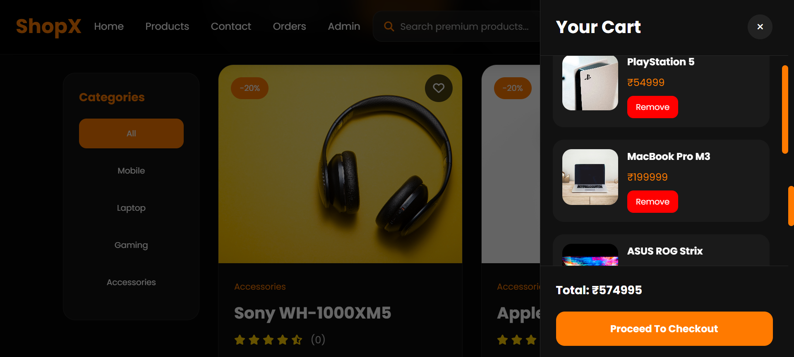
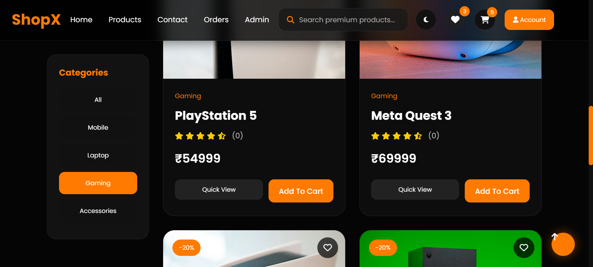
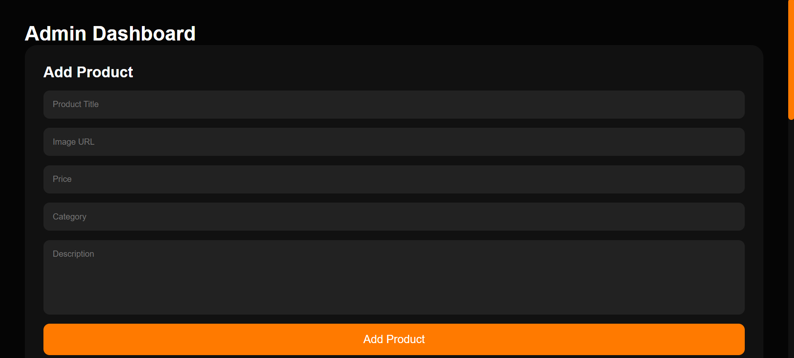
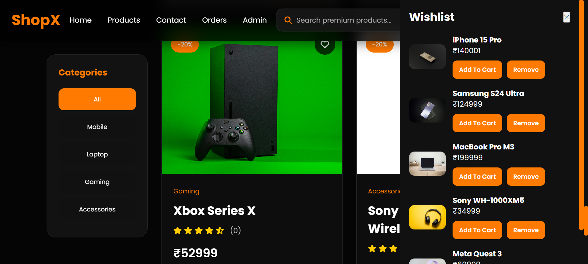
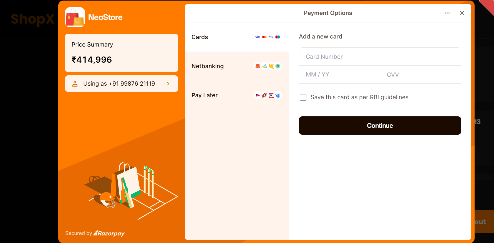

# ShopX – Full Stack E-Commerce Platform

## Live Demo

Frontend: https://shopx-techstore.netlify.app/

Backend API: https://e-commerce-project-shopx.onrender.com/

---

## Features

* User Authentication (JWT)
* Admin Dashboard
* Product Management
* Shopping Cart
* Wishlist
* Razorpay Payment Integration
* Order Management
* Responsive UI
* MongoDB Atlas Integration

---

## Tech Stack

Frontend:

* HTML
* CSS
* JavaScript

Backend:

* Node.js
* Express.js

Database:

* MongoDB Atlas

Deployment:

* Netlify
* Render

Payment Gateway:

* Razorpay

---

## Installation

### Clone Repository

git clone https://github.com/yourusername/shopx-fullstack-ecommerce.git

### Backend Setup

cd backend
npm install
npm run dev

### Frontend Setup

Open frontend/index.html using Live Server

---

## Environment Variables

Create a .env file inside backend:

PORT=5000 //
MONGO_URI=your_mongodb_uri  //
JWT_SECRET=your_secret  //
RAZORPAY_KEY_ID=your_key  //
RAZORPAY_KEY_SECRET=your_secret

---

# Screenshots

## Homepage

## Categeory

## Cart

## Product

## Admin Dashboard

## Wishlist

## Checkout

---

## Future Improvements

* Product Search
* Filters
* Reviews & Ratings
* Cloudinary Image Upload
* Email Notifications
